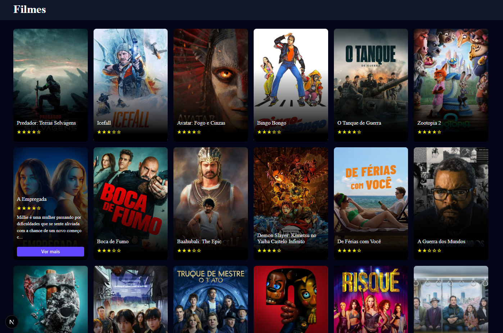

# 🎬 Movie Discovery App

Aplicação moderna e responsiva para descoberta de filmes, desenvolvida com **Next.js**, que consome a API do **TMDB (The Movie Database)** para exibir filmes populares com avaliações, descrições e efeitos interativos.

Este projeto foi criado com o objetivo de **testes, estudos e aprimoramento de conhecimentos** em desenvolvimento frontend moderno.



## 📌 Visão Geral

O **Movie Discovery App** apresenta uma interface limpa e intuitiva, permitindo que usuários visualizem filmes populares de forma dinâmica. A aplicação utiliza recursos modernos do ecossistema React/Next.js e foca em boas práticas de componentização, responsividade e experiência do usuário.

## Funcionalidades

- 🎬 **Descoberta de Filmes**: Navegue por filmes populares do The Movie Database (TMDB)
- ⭐ **Avaliações por Estrelas**: Avaliações visuais por estrelas para cada filme
- 🖼️ **Pôsteres de Filmes**: Pôsteres de alta qualidade com efeitos de hover
- 📱 **Design Responsivo**: Otimizado para desktop e dispositivos móveis
- ⚡ **Carregamento Rápido**: Construído com Next.js para performance ótima
- 🎨 **Interface Moderna**: Layout limpo baseado em cards com animações suaves

## Tecnologias Utilizadas

- **Framework**: [Next.js 16](https://nextjs.org/) - Framework React para produção
- **Linguagem**: [TypeScript](https://www.typescriptlang.org/) - JavaScript com tipagem segura
- **Estilização**: [SCSS/Sass](https://sass-lang.com/) - Pré-processador CSS
- **API**: [The Movie Database (TMDB) API](https://www.themoviedb.org/documentation/api)
- **Cliente HTTP**: [Axios](https://axios-http.com/) - Cliente HTTP baseado em promises
- **Ícones**: Caracteres Unicode (sem bibliotecas de ícones externas)

## Estrutura do Projeto

```
movies-app/
├── src/
│   ├── app/
│   │   ├── components/
│   │   │   ├── MovieCard/          # Componente de card individual do filme
│   │   │   │   ├── index.tsx        # Componente MovieCard
│   │   │   │   └── index.scss       # Estilos MovieCard
│   │   │   ├── MovieList/          # Container da lista de filmes
│   │   │   │   ├── index.tsx        # Componente MovieList
│   │   │   │   └── index.scss       # Estilos MovieList
│   │   │   ├── StarRating/         # Exibição de avaliação por estrelas
│   │   │   │   ├── index.tsx        # Componente StarRating
│   │   │   │   └── index.scss       # Estilos StarRating
│   │   │   └── Navbar/             # Componente de navegação (uso futuro)
│   │   ├── globals.scss            # Estilos globais
│   │   ├── layout.tsx              # Layout raiz
│   │   └── page.tsx                # Página inicial
│   └── types/
│       └── movie.tsx               # Interfaces TypeScript
├── public/                         # Assets estáticos
├── package.json                    # Dependências e scripts
├── next.config.ts                  # Configuração Next.js
└── tsconfig.json                   # Configuração TypeScript
```

## Começando

### Pré-requisitos

- Node.js 18.x ou superior
- npm, yarn, pnpm ou bun

### Instalação

1. **Clone o repositório**
   ```bash
   git clone <url-do-repositorio>
   cd movies-app
   ```

2. **Instale as dependências**
   ```bash
   npm install
   # ou
   yarn install
   # ou
   pnpm install
   # ou
   bun install
   ```

3. **Configure as variáveis de ambiente**

   Crie um arquivo `.env.local` no diretório raiz e adicione sua chave da API TMDB:

   ```env
   TMDB_API_KEY=sua_chave_api_aqui
   ```

   Obtenha sua chave da API em [The Movie Database](https://www.themoviedb.org/settings/api).

4. **Execute o servidor de desenvolvimento**
   ```bash
   npm run dev
   # ou
   yarn dev
   # ou
   pnpm dev
   # ou
   bun dev
   ```

5. **Abra seu navegador**

   Navegue para [http://localhost:3000](http://localhost:3000) para ver a aplicação.

## Scripts Disponíveis

- `npm run dev` - Inicia o servidor de desenvolvimento
- `npm run build` - Compila a aplicação para produção
- `npm run start` - Inicia o servidor de produção
- `npm run lint` - Executa ESLint para análise de código

## Configuração da API

A aplicação utiliza a API do The Movie Database (TMDB) para buscar dados de filmes. Certifique-se de:

1. Criar uma conta no TMDB
2. Solicitar uma chave da API
3. Adicionar a chave às suas variáveis de ambiente

## 🚀 Objetivo do Projeto

Este é um aplicativo simples, desenvolvido exclusivamente para:

- Praticar conceitos de Next.js
- Consumir APIs externas
- Trabalhar com renderização de dados dinâmicos
- Aprimorar habilidades em UI/UX e responsividade
- Servir como base para projetos futuros mais completos

## 📚 Observações

- Este projeto não possui fins comerciais
- Todos os dados são fornecidos pela API pública do TMDB
- Ideal para estudos, testes e portfólio

📫 Sinta-se à vontade para contribuir, sugerir melhorias ou utilizar como base para outros projetos.
